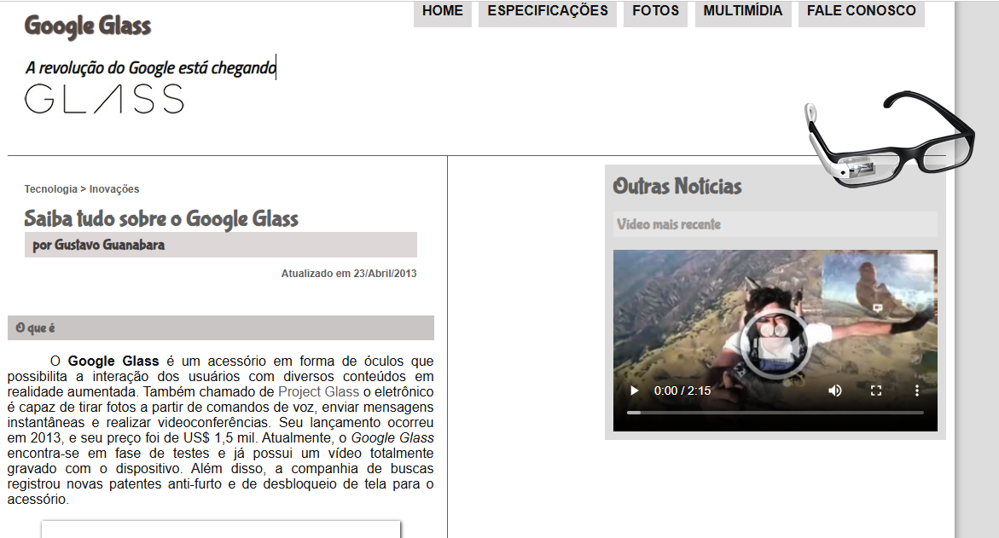

# 🕶️ Tudo sobre Google Glass

Site informativo sobre o Google Glass, desenvolvido como projeto prático do curso **HTML5 e CSS3** do professor **Gustavo Guanabara** (Curso em Vídeo).

## 📸 Preview

## 📄 Páginas

- **index.html** — Página inicial
- **specs.html** — Especificações técnicas
- **fotos.html** — Galeria de fotos
- **multimidia.html** — Multimídia
- **fale-conosco.html** — Formulário de contato

## 📁 Estrutura de Pastas
projeto-glass-html5/

├── README.md

├── _css/

│   ├── estilo.css

│   ├── form.css

│   ├── fotos.css

│   ├── media.css

│   └── specs.css

├── _fonts/

├── _imagens/

├── _interface/

├── _javascript/

├── _media/

├── _textos/

├── fale-conosco.html

├── fotos.html

├── google-glass.html

├── index.html

├── multimidia.html

└── specs.html

## 📋 Funcionalidades do Formulário

- Identificação do usuário (nome, senha, e-mail, sexo, data de nascimento)
- Endereço completo com seleção de estado e autocomplete de cidade
- Grau de urgência com slider
- Campo de mensagem
- Pedido de interesse no Google Glass com cálculo automático de preço total

## 🛠️ Tecnologias

- HTML5
- CSS3
- JavaScript

## 👨‍🏫 Créditos

Projeto desenvolvido seguindo as aulas do [Curso em Vídeo](https://www.cursoemvideo.com) por **Gustavo Guanabara**.
